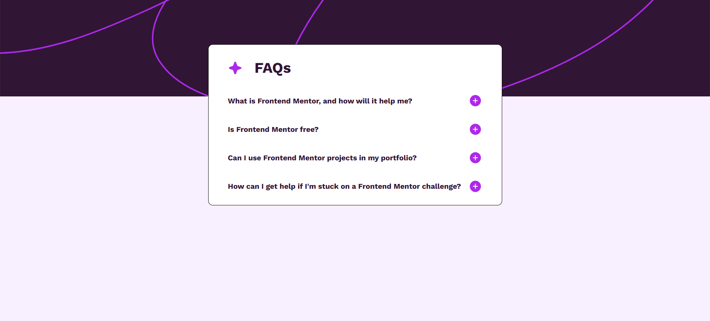
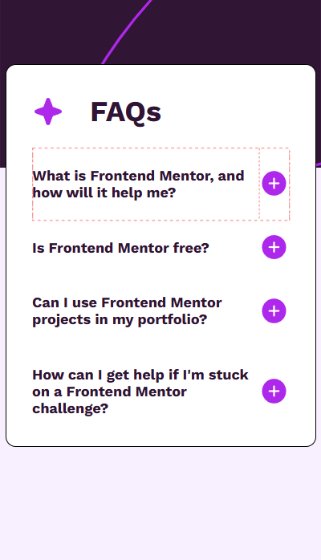

# FAQ Accordion

This project is an FAQ accordion built using HTML, CSS. It provides an interactive way to display frequently asked questions, allowing users to expand and collapse answers.





## Features

- Responsive design
- Uses semantic HTML elements (<details> and <summary>) for accessibility

## Setup Instructions

1. Clone the repository:
```bash
git clone https://github.com/Amitk4600/FAQ-accordion.git